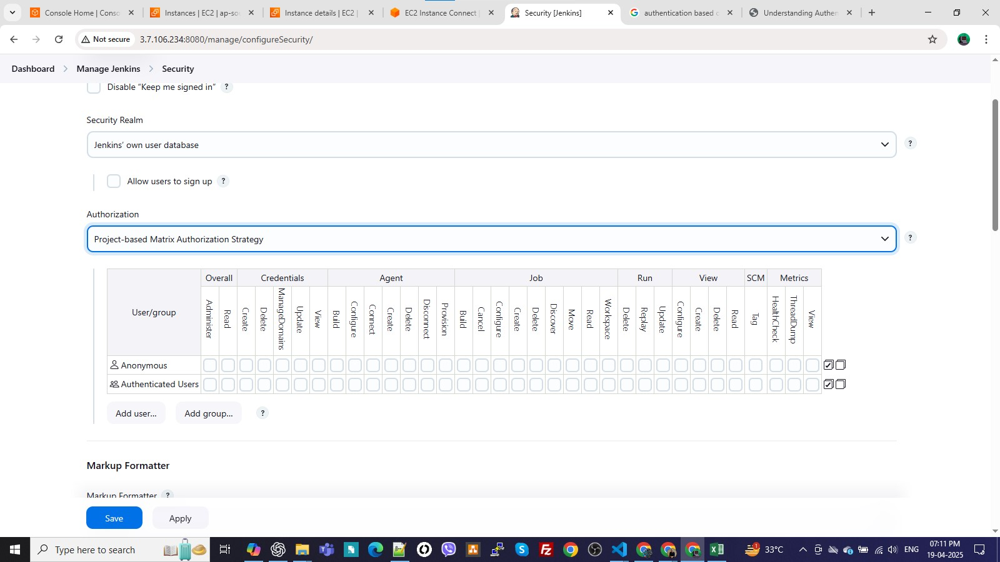

### 1. Install Multiple JDKs in Jenkins:
**JDK is a required dependency to build Java apps**
- Your project might also declare runtime dependencies in pom.xml (Maven) or build.gradle (Gradle). <br>
Go to: <br>
**Manage Jenkins → System Configuration → Tools → JDK installations** <br>
**Jobs default folder -> /var/lib/jenkins/jobs** 

Click Add JDK twice (for each version)

Uncheck "Install automatically" if you have it installed already <br>

Give each a name, e.g.: <br>
which java <br>
java --version <br>
jdk8 → Path: /usr/lib/jvm/java-8-openjdk<br>
jdk11 → Path: /usr/lib/jvm/java-11-openjdk<br>

you can verify the java version on which jenkins is running on the jenkins UI:<br>
Manage jenkins -> system information<br>
jenkins service -> sudo nano /usr/lib/systemd/system/jenkins.service<br>
sudo systemctl daemon-reexec<br>
sudo systemctl daemon-reload<br>
sudo systemctl restart jenkins<br>

### 2. Reference JDKs in Jenkins Pipeline
In a Declarative Pipeline:
```sh
pipeline {
    agent any

    tools {
        jdk 'jdk8'  // or 'jdk11'
    }

    stages {
        stage('Build') {
            steps {
                sh 'java -version'
                sh 'echo Welcome !'
            }
        }
    }
}

```
### 3. Matrix-based security: 
Manage Jenkins -> Security -> Authorization (select Matrix-based Security) <br>

-> add user (fill username) -> give overall Read permission(as per your requirement) -> save <br>

Example: We have provided ‘Read’ and ‘Build job’ permission only. <br>
